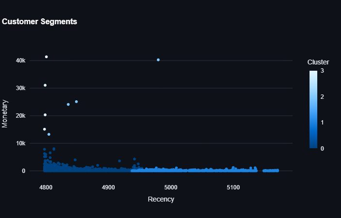

# Customer Segmentation Dashboard

A Python-based project that analyzes customer purchasing behavior using RFM (Recency, Frequency, and Monetary) metrics. This project includes a modular implementation with Python scripts, an interactive Streamlit dashboard, and a Jupyter Notebook for step-by-step execution.

Table of Contents

   1. Features

   2. Demo and Screenshots

   3. Project Structure

   4. Installation

   5. Usage

      Option 1: Jupyter Notebook

      Option 2: Streamlit Dashboard

   6. Sample Dataset

   7. Contributing

   8. License

## 1. Features

- Perform RFM analysis to classify customers into segments based on their purchasing behavior
- Explore and visualize RFM metrics with a user-friendly Streamlit interface
- Upload your own dataset to analyze and visualize customer data
- Modular Python scripts and a Jupyer notebook for flexible usage
- Exportable results for marketing campaigns

 Technologies
- *Language*: Python
- *Data analysis and Modeling*: Pandas, Scikit-learn
- *Dashboard*: Streamlit
- *Data viz*: Matplotlib, Plotly

## 2. Demo and Screenshots

Streamlit Dashboard

Below is an example of the interactive dashboard generated by this project: 

Customer Segmentation plot:

## 3. Project Structure

      RFM-Segmentation/

         ├── data/                                  # Sample datasets for testing
         ├── src/
         │   ├── SegBook.ipynb                      # Jupyter notebook
         │   ├── data_preprocessing.py              # Script for data cleaning
         │   ├── rfm_model.py                       # Script for RFM calculation
         |   ├── main.py                            # Script
         ├── dashboard/
         │   └── app.py                             # Streamlit dashboard
         ├── screenshots/                           # Visuals for the README
         ├── README.md                              # Project documentation
         ├── requirements.txt                       # Python dependencies
         ├── LICENSE                                # License file
         ├── .gitignore                             # Files to ignore

## 4. Installation

   1. Clone the repository:

            git clone https://github.com/yourusername/RFM-Segmentation.git
            cd RFM-Segmentation-Dashboard

 2. Install the required dependencies:

         pip install -r requirements.txt

3. (Optional) Set up a virtual environment:

         python -m venv venv
         source venv/bin/activate  # Linux/macOS
         venv\Scripts\activate     # Windows

## 5. Usage

   Option 1: Jupyter Notebook

   1. Navigate to the src/ directory:

            cd src

   2. Open the notebook:

            jupyter notebook rfm_segmentation_dashboard.ipynb

   3. Follow the step-by-step instructions in the notebook to run the analysis.

Option 2: Streamlit Dashboard

   1. Navigate to the project root directory.

   2. Run the Streamlit app:

            streamlit run dashboard/app.py

   3. Open your browser at the displayed URL (e.g., http://localhost:8501).

   4. Upload your dataset in CSV format to view insights and visualizations.

## 6. Sample Dataset

Use the data/Online Retail.csv file provided in the data/ folder to test the project. The dataset should be structured as follows:

|Column Name | Description                        | Data type | Example  |
|------------|------------------------------------|-----------|----------|
|CustomerID  |Unique identifier for each customer | Integer or text| 123 |
|InvoiceDate | Date of the transaction            | Date      |2025-12-31|
|UnitPrice   | Amount spent by a customer in a single transaction   | Float or integer  | 156.78|   

## 7. Contributing

Contributions are welcome! Here’s how you can help:

1. Fork the repository.

2. Create a feature branch:

         git checkout -b feature-name

3. Commit your changes:

         git commit -m "Add your message"

4. Push to your branch:

         git push origin feature-name

5. Open a pull request.

## 7. License

This project is licensed under the MIT License. See the LICENSE file for details.

## Contact

For questions or feedback, please don't hesitate to reach out. My socials are all available in my page.